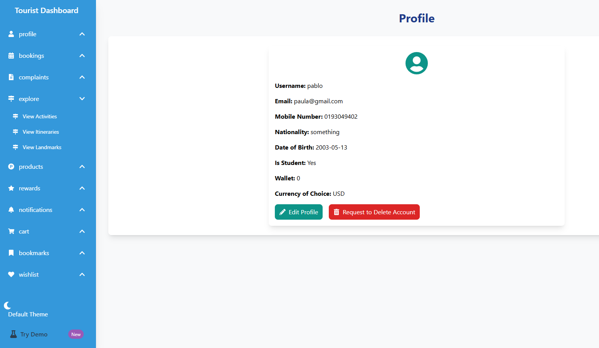
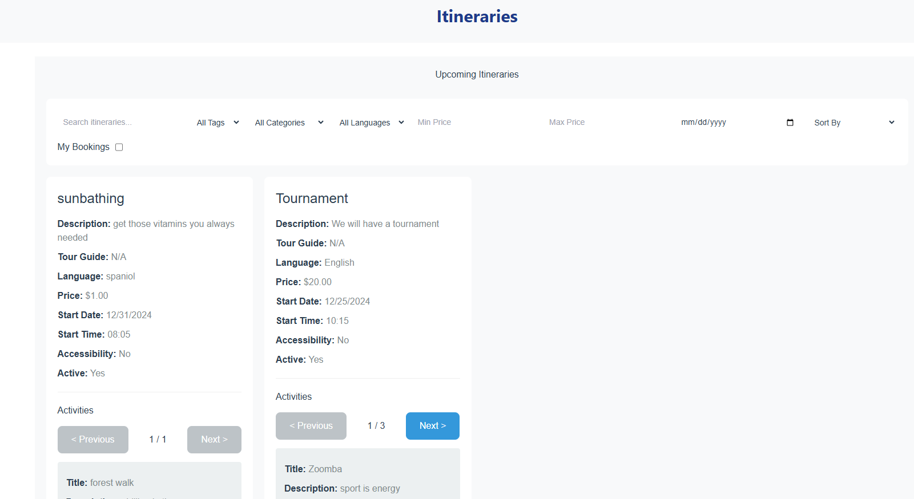

# **Voyago**

## Motivation

The motivation behind this backend application is to provide a comprehensive tourism platform that connects tourists, advertisers, tour guides, sellers, and tour governors. The system aims to facilitate bookings for activities and itineraries, handle e-commerce product sales, manage complaints, notifications, and more—all in one unified backend. It was designed to serve as a foundation for a fully integrated travel and tourism platform, streamlining both administrative and customer-facing operations.

---

## Build Status

- **Current Status:** Functional but under continuous development.
- **Known Issues:**
  - Some endpoints may not have complete unit/integration tests yet.
  - Authentication and authorization strategies may need further enhancement.
- **Planned Enhancements:**
  - Add more comprehensive testing with Jest or Postman collections.
  - Improve error handling and input validation.
  - Work on unifying UI theme throughout application
  - Providing meaningful error messages

---

## Code Style

The code primarily follows the standard ES6+ JavaScript conventions:

- Uses `import`/`export` syntax for module management.
- Common patterns like `async/await` for asynchronous operations.
- models, controllers, and routes architecture for backend
- Modular frontend components through react

_Linting with ESLint or similar tools is recommended but not currently enforced._

---

## Screenshots

**Front Page**  


**Tourist Dashboard**  


**Itineraries View**


---

## Tech/Framework Used

### MERN

An abbreviation for a popular tech stack.

- **M**ongoDB
  - The Database
- **E**xpress
  - The web framework
- **R**eact
  - A modular frontend framework
- **N**odejs
  - The server-side language used

### Important Packages

**Authentication:**

- JWT (Json Web Tokens)

**Miscellaneous:**

- Multer for file uploads
- Nodemailer for sending emails
- Cloudinary (optional) for hosting images
- bcrypt for password hashing
- date-fns for date manipulation
- Mongoose models for representing `User`, `Tourist`, `Activity`, `Itinerary`, `Product`, etc.

---

## Features

### ✨Top 3✨

- Book from hundreds of itineraries made by trusted tour guides!
- Support for plethora of payment methods to suite your needs
- Products that will provide for cool souvenirs for you and as gifts.

### Core features

**User Management:**

- Create, update, and delete users with different roles: Tourist, Tour Guide, Advertiser, Seller, Tour Governor, Admin.
- Password reset via OTP.

  **Activity & Itinerary Booking:**

- Book, cancel, and view upcoming and past bookings for activities and itineraries.
- Rate and review activities, itineraries, and tour guides.

**E-Commerce Capabilities:**

- Add, update, and remove products.
- Manage product inventory, orders, and cart functionality.
- Wishlist management for tourists.

**Complaints & Flagging:**

- File complaints on activities and itineraries.
- Admin can respond to or resolve complaints.
- Flag inappropriate activities and itineraries, issue refunds, and cancel bookings automatically.

**Notifications:**

- Real-time notifications for flagged activities/itineraries.
- Promotional notifications via email (e.g., promo codes).

**Revenue & Reporting:**

- Revenue calculations by month, date, or overall.
- View sales reports for Tour Guides and Advertisers.
- Total tourist count and analytics.

---

## Code Examples

**Creating a new Activity Category (Admin Only):**

```js
// AdminController.js (excerpt)
const createActivityCategory = async (req, res) => {
  const activityCategory = req.body;
  try {
    const newActivityCategory = new ActivityCategory(activityCategory);
    const savedActivityCategory = await newActivityCategory.save();
    res.status(201).json(savedActivityCategory);
  } catch (error) {
    res.status(500).json({ error: error.message });
  }
};
```

**Booking an Activity:**

```js
// TouristController.js (excerpt)
const bookActivity = async (req, res) => {
  try {
    const { activityId, touristId } = req.body;

    // ... validation and wallet checks ...

    const newBooking = new ActivityBooking({
      activity: activityId,
      tourist: touristId,
    });
    const savedBooking = await newBooking.save();
    res.status(201).json(savedBooking);
  } catch (error) {
    console.error("Error booking activity:", error);
    res.status(500).json({ error: error.message });
  }
};
```

---

## Installation

### Fork Repo

_Current state of repo is private, following information is for when it is open for public contributions_

1. Go to repo
2. press fork option
3. go to forked project which now lives as one of your repositories

### Clone Project

```bash
git clone https://github.com/your-username/Voyago.git
cd Voyago
```

### Install Dependencies

There are two main directories that have dependencies. Those are namely

- backend
- voyago_ui

backend is where the code for the server that provides the API endpoints lives.

voyago_io is where the code for the frontend application which invokes the endpoints and displays them on the browser lives.

To handle the dependencies for both of those:

```bash
cd backend
npm install
cd ../voyago_ui
npm install
```

### Setup Stripe Account

Stripe is the server that will be responsible for handling user payments. Voyago relies on it to provide secure payments for its users using multiple payment methods.

The Stripe account will be the main way in which stripe will know about the existance of Voyago and the manner by which it should interact with it.

It will also contain all the stats about the products, prices and gross rates, etc...

1. visit https://stripe.com/
2. sign in to gain access to test mode features
3. press the developers option on the bottom left corner of the dashboard
4. Choose _Api Keys_
5. In standard keys, press the _Reveal test key_ option to obtain the key to be placed inside of .env file to handle interactions with stripe APIs. **Store this value for later**

### Install Stripe CLI

This will be used later on to provide a method for the stripe server to reach our server when significant events occur on their part involving our customers.

1. press developer options inside of stripe dashboard
2. choose _Webhooks_
3. Click on _Add local listener_
4. Press link "Download the Stripe CLI"
5. Follow the documentation on download process and login setup

Once the CLI is open and a login session has been authenticated by stripe, execute this command to start getting events from stripe about users' payments for the app's products

```bash
stripe listen --forward-to http://localhost:8000/api/stripe/webhook
```

A key will be provided upon execution of command. This is the _STRIPE_WEBHOOK_SECRET_KEY_ which will be placed inside of .env file in the next step.

### Setup MongoDB Cluster

This is the database used to hold all information about users and entities like bookings, carts, payment receipts and so on.

_A MongoDB URI is needed to specify where Voyago should send and retrieve its data._

To get one, first setup an account on MongoDB Atlas which will the host your database and manage it for you so that you don't need to host or manage performance of your database.

1. create a free cluster
2. set the accessible IPs to include your machine (or have all IPs allowed - \*Not recommended).
3. obtain the connection string for the Node driver. **Store this value for later**

For a more guided approach, follow the steps in this link: [Get Started with Atlas](https://www.mongodb.com/docs/atlas/getting-started/)

### Setup Environment File

Finally, once all the previous work has been done, all the _store this value for later_ parts will be added here.

Create a `.env` file directly under _backend_ directory with these elements:

- MongoDB URI (obtained previously)
- JWT secret - any string which will be part of digital signature verifications - make it complex
- STRIPE_SECRET_KEY (this is the key which was revealed under the stripe API Keys)
- STRIPE_WEBHOOK_SECRET_KEY (this is the key obtained inside of webhook section)

```bash
MONGODB_URI = mongodb+srv://<user>:<pass>@cluster0.mongodb.net/mydb?retryWrites=true&w=majority

JWT_SECRET = supersecret

STRIPE_SECRET_KEY = <insert key obtained prev>
STRIPE_WEBHOOK_SECRET_KEY = <insert key obtained prev>
```

### Start Application

Go to each of main directories (backend, voyago_ui) and execute the following command.

```bash
npm run dev
```

Make sure to do this in **two different** terminals as once one is running, it will not pause until server is shutdown.

Go to http://localhost:5173/ to start browing the website.

---

## API References

**Base URL:** `http://localhost:8000/api`

- **Auth & User:**
  - `POST /user/create-user`
  - `POST /user/login`
  - `PUT /user/update-user/:userId`
  - `DELETE /user/delete-user/:userId`
- **Tourist:**
  - `POST /tourist/create-tourist`
  - `GET /tourist/get-tourist/:touristId`
  - `POST /tourist-rate-activity/:touristId`
  - `POST /tourist-file-itinerary-complaint/:touristId`
  - `GET /get-upcoming-bookings/:touristId`
- **Activity & Itinerary:**
  - `POST /advertiser/create-activity`
  - `GET /advertiser/get-activity/:activityId`
  - `POST /tourguide/create-itinerary`
  - `GET /tourguide/get-itinerary/:itineraryId`
- **Product & E-Commerce:**
  - `POST /seller/create-product`
  - `GET /seller/get-product/:productId`
  - `GET /cart/:touristId` (Cart Items)
  - `POST /cart/:touristId/:productId` (Add to Cart)
  - `POST /orders/checkout` (Complete Order)
- **Complaints & Flags:**
  - `POST /admin/mark-activity-complaint`
  - `POST /admin/reply-to-activity-complaint`
  - `PUT /admin/flag-inapproperiate-activity/:activityId`

_(This is a non-exhaustive list. Each controller file contains more routes. Refer to the respective controller and routes directories for full coverage.)_

---

## Tests

- **Postman Tests:**  
   Basic test collections can be run using Postman by importing the provided `Voyago.postman_collection.json`.
- **Jest Tests (Optional):**  
   Future improvements may include Jest tests for each endpoint. For now, manual testing via Postman or similar tools is suggested.

---

## How to Use

1. **Authentication:**  
   Register as a user via `POST /user/create-user`. Then login with `POST /user/login`.
2. **Role-Based Actions:**  
   Depending on the user's role (TOURIST, TOUR_GUIDE, ADVERTISER, SELLER, ADMIN), they have different endpoints available.
3. **Booking & Purchasing:**  
   As a TOURIST, use the endpoints to view activities, itineraries, add products to cart, and checkout orders.
4. **Complaints & Ratings:**  
   TOURISTS can file complaints or rate services/products. Admin can resolve these complaints.

---

## Contribute

Contributions are welcome! Please open an issue or submit a pull request if you find bugs or want to add features. Keep in mind:

- The project is not Finished. Constructive suggestions are appreciated.
- Review the open issues for tasks to pick up.

### Contribution

---

## Credits

**Developers:**

- Anwar Saeed - Our scrum master
- Mohamed saeed
- Paula Maged
- Ahmed Hossam
- Omar abdelhamid
- Abdelrahman Elshamy
- Mohamed Zahran

**References & Acknowledgements:**

- Official Node.js and Express documentation
- MongoDB Mongoose documentation
- Stack Overflow discussions
- Youtube videos for Mongoose and Express tutorials
  - Net-Ninja is a fantastic youtube channel
- Stripe and their documentation

---

## License

This project is licensed under the **Apache 2.0 License**.

This is a _permissive free_ software license that allows users to use the software for _any_ purpose.
